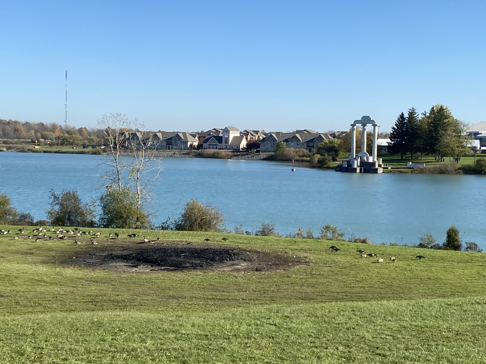
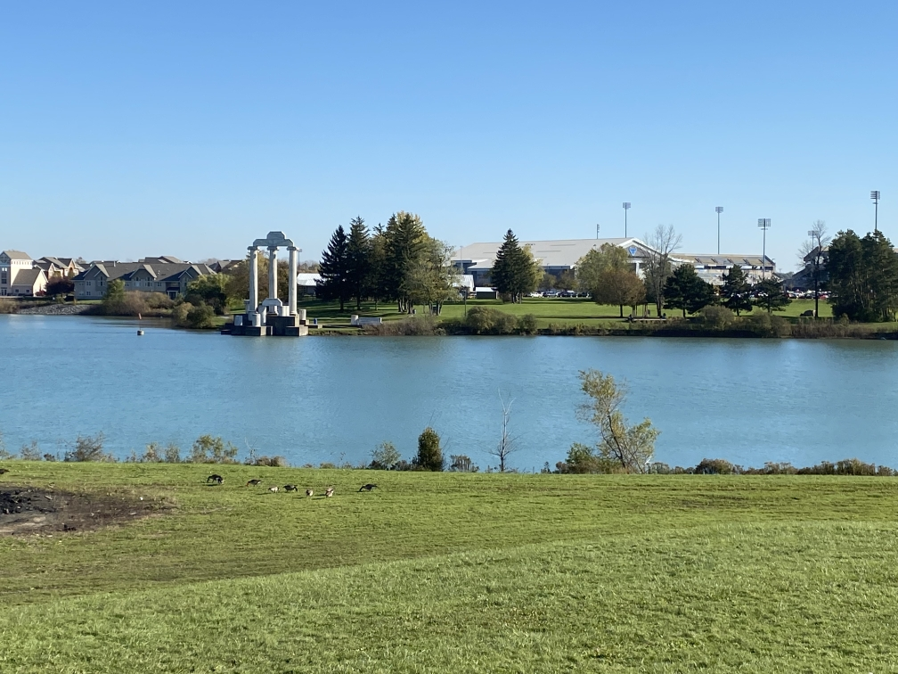

# Image_Stitching

Image Stitching based on SIFT and ORB

## Requirements

OpenCV>=4.4.0
NumPy

## Steps to use

Function for stitching

```
solution(left_img, right_img, feature_method = 'sift', sift_features = 1000,  ratio = 0.75):
    """
    :param left_img:
    :param right_img:
    :param feature_method: descriptor method to be used
    :param sift_features: if 'sift' max features to be used
    :param ratio: \eta for ratio testing
    :return: final_img
    """
```

1. Change line number 195, 196, 197, 198 in stitch.py based on the files names of the images you want to stitch together, feature detector and output file name
2. Run stitch.py

## Example

### Input





### Output Comparison


